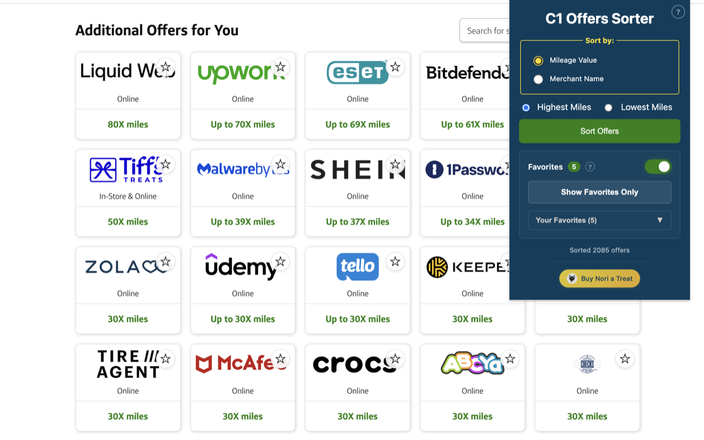

# C1 Offers Sorter

> Enhance your Capital One rewards experience with intelligent sorting and favorites management



## ✨ Features

**Smart Sorting**

- Sort offers by highest or lowest mileage rewards
- Sort alphabetically by merchant name
- Handles all mileage formats (2X miles, 60,000 miles, etc.)
- Automatically loads all available offers before sorting

**Favorites Management**

- Mark your favorite offers with a star
- View all favorites in the extension popup
- Filter to show only favorited offers on the page
- Favorites persist across browsing sessions

**Security**

- All data stored locally—nothing sent to external servers
- Open source and transparent

## 🚀 Quick Start

1. **Install the Extension**

   - Install from the [Chrome Web Store](https://chrome.google.com/webstore) (coming soon)
   - The extension icon will appear in your Chrome toolbar

2. **Use the Extension**
   - Visit your [Capital One account](https://myaccounts.capitalone.com/accountSummary)
   - Click "View all Offers"
   - Click the extension icon in your toolbar
   - Choose your sorting preference and click "Sort Offers"

That's it! Your offers will be reorganized instantly.

## 📦 Installation

### From Chrome Web Store (Recommended)

The extension will be available on the Chrome Web Store soon. Once published, simply click "Add to Chrome" to install.

### For Developers

If you want to build from source or contribute to the project, see the [Development Guide](docs/DEVELOPMENT.md) for detailed instructions on building and running the extension locally.

## 🎯 Usage

### Sorting Offers

1. Navigate to the Capital One offers page:

   - Go to [myaccounts.capitalone.com](https://myaccounts.capitalone.com/accountSummary)
   - Click "View all Offers"

2. Click the extension icon in your Chrome toolbar

3. Choose your sorting criteria:

   - **Sort by Mileage**: Highest or Lowest miles
   - **Sort Alphabetically**: A-Z or Z-A by merchant name

4. Click "Sort Offers"

5. The extension automatically loads all pages of offers and reorganizes them based on your selection

### Managing Favorites

1. **Add Favorites**: Click the star icon on any offer to mark it as a favorite

2. **View Favorites**: Click the extension icon to see your favorites list in the popup

3. **Remove Favorites**: Click the X button next to any favorite in the popup, or click the star again on the offer

4. **Filter by Favorites**: Click "Show Favorites Only" to display only your starred offers on the page

## 🔒 Privacy & Security

Your privacy matters. This extension:

- ✅ Stores all data **locally** in your browser only
- ✅ **Never transmits** data to external servers
- ✅ Only activates on official Capital One domains
- ✅ Uses minimal permissions (activeTab, scripting, storage)
- ✅ Open source—review the code anytime

Read the full [Privacy Policy](docs/PRIVACY.md).

### Required Permissions

| Permission  | Why We Need It                                                  |
| ----------- | --------------------------------------------------------------- |
| `activeTab` | Access the Capital One offers page when you click the extension |
| `scripting` | Inject sorting and favorites functionality into the page        |
| `storage`   | Save your favorite offers locally in your browser               |

## 🛠️ Technical Details

- **Framework**: React 18 + TypeScript 5
- **Build Tool**: Vite 5
- **Extension API**: Chrome Manifest V3
- **Browser Support**: Chrome 109+

### Architecture

- React component architecture with custom hooks and service layers
- Type-safe Chrome API wrappers with TypeScript
- Comprehensive test coverage with Vitest
- Resilient DOM selectors for Capital One's page structure
- MutationObserver-based pagination detection

## 🤝 Contributing

Contributions are welcome! Whether you're fixing bugs, adding features, or improving documentation:

1. Fork the repository
2. Create a feature branch (`git checkout -b feature/amazing-feature`)
3. Make your changes and add tests if applicable
4. Run tests: `yarn test:run`
5. Build and test the extension: `yarn build`
6. Commit your changes (`git commit -m 'Add amazing feature'`)
7. Push to your fork (`git push origin feature/amazing-feature`)
8. Open a Pull Request

### Development Commands

```bash
yarn start          # Dev server with hot reload
yarn build          # Production build
yarn test           # Run tests in watch mode
yarn test:run       # Run tests once
yarn test:ui        # Run tests with UI
```

## 📝 License

This project is open source and available under the MIT License.

## 💬 Support

Having issues or suggestions?

- **Bug Reports**: [Open an issue](https://github.com/noritheshibadev/c1offersort/issues)
- **Feature Requests**: [Start a discussion](https://github.com/noritheshibadev/c1offersort/discussions)
- **Questions**: Check existing issues or open a new one

## ☕ Support the Developer

If you find this extension helpful, consider [buying Nori a treat](https://buymeacoffee.com/shibadev)!

---

**Note**: This extension is not affiliated with or endorsed by Capital One. It's an independent tool created to enhance the user experience of Capital One rewards offers.
